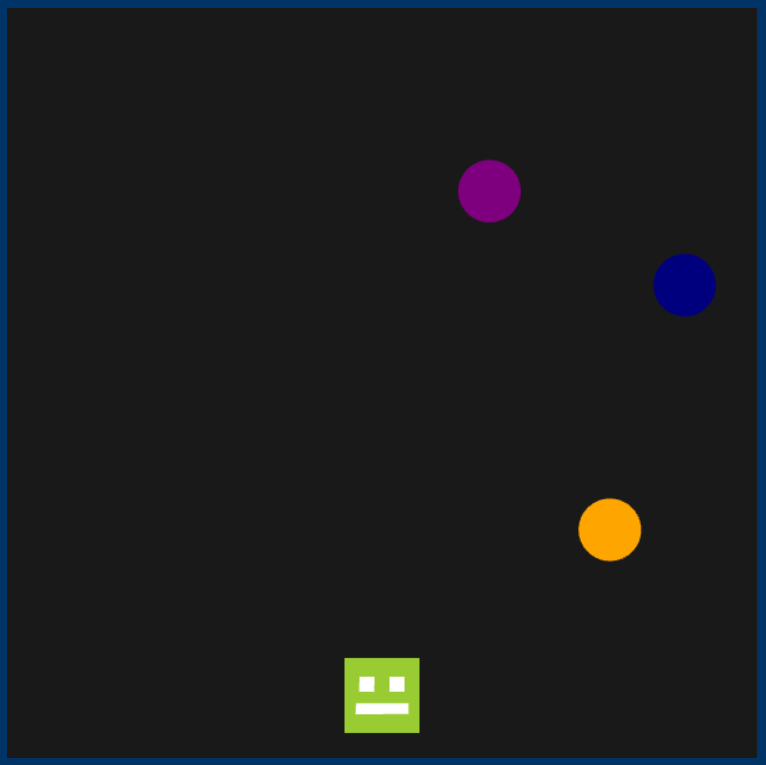

## PROYECTOS

## 1. Requisitos


Para ejecutar los programas, puedes seguir una de las siguientes opciones:

### Opción 1: Usar Open Live Server

1. Instalar la extensión **Open Live Server** en **Visual Studio Code**.
2. Abrir el archivo HTML desde Visual Studio Code.
3. Ejecutar **Open Live Server** desde el menú contextual o la barra de estado.

### Opción 2: Usar un servidor web local

Instalar uno de los siguientes servidores web en tu máquina:
- **WampServer**
- **AppServ**
- **Apache**
- **XAMPP**

Configura el servidor web local para apuntar al directorio donde están tus archivos y accede desde el navegador.

```plaintext
http://localhost/nombre-del-proyecto
```

## 2. Descripción de Proyectos

### Proyecto 1: Creación de una Escena con Primitivas en 2D
---

Desarrollo de una escena interactiva usando primitivas 2D como líneas y triángulos, explorando las capacidades de **WebGL 2.0** para manejar formas, colores y transformaciones básicas.

<div align="center" style="border: 2px solid #444; padding: 10px; display: inline-block; border-radius: 6px;">
  
</div>

---
### Proyecto 2: Interacción en una Cuadrícula con Objetos en 2D  
---

Desarrollo de un sistema interactivo en 2D con **WebGL**, donde un objeto simula el movimiento de una pieza de ajedrez dentro de una cuadrícula. El objetivo es recolectar zanahorias distribuidas en el tablero. La posición y el color del objeto varían dinámicamente según las interacciones del usuario con el entorno gráfico.

<div align="center" style="border: 2px solid #444; padding: 10px; display: inline-block; border-radius: 6px;">
  
</div>

---

### Proyecto 3: Detección de Colisiones entre Objetos en 2D  
---

Implementación de un sistema para detectar colisiones entre un círculo y un cuadrado utilizando **WebGL**. La lógica calcula la distancia entre ambos objetos y la compara con el radio del círculo para determinar una colisión. Al detectarse una colisión, se alteran las propiedades visuales de los objetos, como el color o el tamaño.

<div align="center" style="border: 2px solid #444; padding: 10px; display: inline-block; border-radius: 6px;">
  
</div>

---

### Proyecto 4: Integración de Sprites en Escenas 2D  
---

Incorporación de **sprites 2D** dentro de una escena gráfica con **WebGL 2.0**, utilizados para representar elementos visuales decorativos o interactivos. El sistema permite manipular los sprites en tiempo real, ofreciendo mayor riqueza visual y dinamismo en las escenas.


---

### Proyecto 5: Visualización de Modelos 3D desde Archivos JSON  
---

Desarrollo de un visor de modelos tridimensionales cargados desde archivos en formato **JSON**. El sistema interpreta datos estructurados de geometría y color, y los renderiza en una escena 3D utilizando **WebGL**, facilitando una representación eficiente y personalizable de objetos.


---

### Proyecto 6: Renderizado de Modelos 3D en Formato OBJ  
---

Creación de un sistema de lectura y visualización de modelos 3D en formato **OBJ** mediante **WebGL 2.0**. Se soportan geometrías complejas, materiales y texturas, permitiendo importar modelos desde software de diseño 3D y renderizarlos de forma realista en un entorno web.


